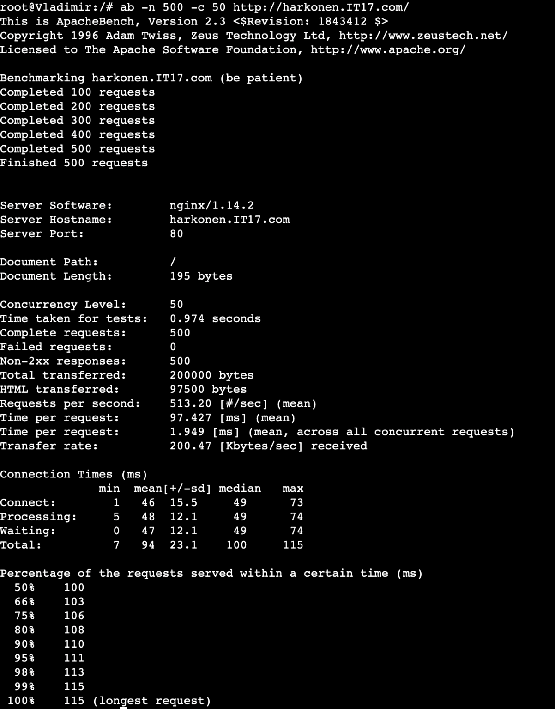
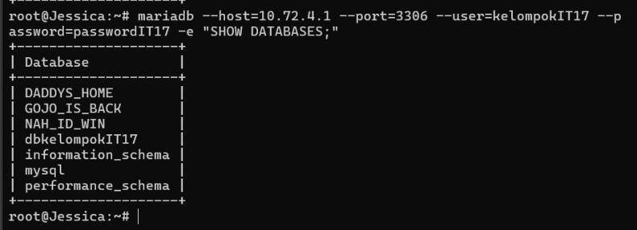
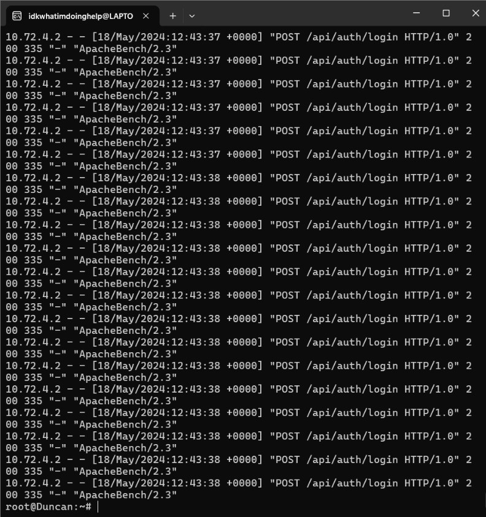

# Jarkom-Modul-3-IT17-2024

##### Praktikum Jaringan Komputer Modul 3 Tahun 2024

### Author
| Nama | NRP |
|---------|---------|
| Mutiara Nurhaliza | 5027221010   |
| Aqila Aqsa | 5027211032   |

# Laporan Resmi

# Daftar Isi
- [Konfigurasi](#topologi)
- [Nomor 0](#soal-0)
- [Nomor 1](#soal-1)
- [Nomor 2](#soal-2)
- [Nomor 3](#soal-3)
- [Nomor 4](#soal-4)
- [Nomor 5](#soal-5)
- [Nomor 6](#soal-6)
- [Nomor 7](#soal-7)
- [Nomor 8](#soal-8)
- [Nomor 9](#soal-9)
- [Nomor 10](#soal-10)
- [Nomor 11](#soal-11)
- [Nomor 12](#soal-12)
- [Nomor 13](#soal-13)
- [Nomor 14](#soal-14)
- [Nomor 15](#soal-15)
- [Nomor 16](#soal-16)
- [Nomor 17](#soal-17)
- [Nomor 18](#soal-18)
- [Nomor 19](#soal-19)
- [Nomor 20](#soal-20)

### Topologi
<a name="topologi"></a>


### Config
#### Arakis (Router)
```bash
auto eth0
iface eth0 inet dhcp

auto eth1
iface eth1 inet static
	address 10.72.1.0
	netmask 255.255.255.0

auto eth2
iface eth2 inet static
	address 10.72.2.0
	netmask 255.255.255.0

auto eth3
iface eth3 inet static
	address 10.72.3.0
	netmask 255.255.255.0

auto eth4
iface eth4 inet static
	address 10.72.4.0
	netmask 255.255.255.0
```
#### Mohiam (DHCP Server) 
```bash
auto eth0
iface eth0 inet static
	address 10.72.3.2
	netmask 255.255.255.0
	gateway 10.72.3.0
```

#### Irulan (DNS Server) 
```bash
auto eth0
iface eth0 inet static
	address 10.72.4.1
	netmask 255.255.255.0
	gateway 10.72.4.0
```

#### Chani (Database Server) 
```bash
auto eth0
iface eth0 inet static
	address 10.72.4.1
	netmask 255.255.255.0
	gateway 10.72.4.0
```

#### Stilgar (Load Balancer) 
```bash
auto eth0
iface eth0 inet static
	address 10.72.4.2
	netmask 255.255.255.0
	gateway 10.72.4.0
```
#### Leto (Laravel Worker) 
```bash
auto eth0
iface eth0 inet static
	address 10.72.2.1
	netmask 255.255.255.0
	gateway 10.72.2.0
```

#### Duncan (Laravel Worker) 
```bash
auto eth0
iface eth0 inet static
	address 10.72.2.2
	netmask 255.255.255.0
	gateway 10.72.2.0
```

#### Jessica (Laravel Worker) 
```bash
auto eth0
iface eth0 inet static
	address 10.72.2.3
	netmask 255.255.255.0
	gateway 10.72.2.0
```

#### Vladimir (PHP Worker) 
```bash
auto eth0
iface eth0 inet static
	address 10.72.1.1
	netmask 255.255.255.0
	gateway 10.72.1.0
```
#### Rabban (PHP Worker)
```bash
auto eth0
iface eth0 inet static
	address 10.72.1.2
	netmask 255.255.255.0
	gateway 10.72.1.0
```
#### Vladimir (PHP Worker) 
```bash
auto eth0
iface eth0 inet static
	address 10.72.1.3
	netmask 255.255.255.0
	gateway 10.72.1.0
```

<a name="soal-0"></a>
### Soal 0
Planet Caladan sedang mengalami krisis karena kehabisan spice, klan atreides berencana untuk melakukan eksplorasi ke planet arakis dipimpin oleh duke leto mereka meregister domain name atreides.yyy.com untuk worker Laravel mengarah pada Leto Atreides . Namun ternyata tidak hanya klan atreides yang berusaha melakukan eksplorasi, Klan harkonen sudah mendaftarkan domain name harkonen.yyy.com untuk worker PHP (0) mengarah pada Vladimir Harkonen

#### Script

```bash
echo 'nameserver 192.168.122.1' > /etc/resolv.conf
apt-get update
apt-get install bind9 -y  

echo "zone \"atreides.IT17.com\" {
	type master;
	file \"/etc/bind/jarkom/atreides.IT17.com\";
};

zone \"harkonen.IT17.com\" {
	type master;
	file \"/etc/bind/jarkom/harkonen.IT17.com\";
};
" > /etc/bind/named.conf.local

mkdir /etc/bind/jarkom

atreides="
;
;BIND data file for local loopback interface
;
\$TTL    604800
@    IN    SOA    atreides.IT17.com. root.atreides.IT17.com. (
        2        ; Serial
                604800        ; Refresh
                86400        ; Retry
                2419200        ; Expire
                604800 )    ; Negative Cache TTL
;                   
@    IN    NS    atreides.IT17.com.
@       IN    A    10.72.2.1
"
echo "$atreides" > /etc/bind/jarkom/atreides.IT17.com

harkonen="
;
;BIND data file for local loopback interface
;
\$TTL    604800
@    IN    SOA    harkonen.IT17.com. root.harkonen.IT17.com. (
        2        ; Serial
                604800        ; Refresh
                86400        ; Retry
                2419200        ; Expire
                604800 )    ; Negative Cache TTL
;                   
@    IN    NS    harkonen.IT17.com.
@       IN    A    10.72.1.1
"
echo "$harkonen" > /etc/bind/jarkom/harkonen.IT17.com

service bind9 restart

```
#### Output


<a name="soal-1"></a>
### Soal 1

Lakukan konfigurasi sesuai dengan peta yang sudah diberikan. 

#### Output
Sesuai konfigurasi diatas

### Soal 2

Client yang melalui House Harkonen mendapatkan range IP dari [prefix IP].1.14 - [prefix IP].1.28 dan [prefix IP].1.49 - [prefix IP].1.70

Melakukan setup DHCP Relay terlebih dahulu pada Arakis.

` /etc/default/isc-dhcp-relay `
```bash
iptables -t nat -A POSTROUTING -o eth0 -j MASQUERADE -s 10.72.0.0/16
apt-get update
apt install isc-dhcp-relay -y

service isc-dhcp-relay start 

echo '# Defaults for isc-dhcp-relay initscript

# sourced by /etc/init.d/isc-dhcp-relay 
# installed at /etc/default/isc-dhcp-relay by the maintainer scripts

#
# This is a POSIX shell fragment
#

# What servers should the DHCP relay forward requests to?
SERVERS="10.72.3.2"

# On what interfaces should the DHCP relay (dhrelay) serve DHCP requests?
INTERFACES="eth1 eth2 eth3 eth4"

# Additional options that are passed to the DHCP relay daemon?
OPTIONS=""' > /etc/default/isc-dhcp-relay


echo net.ipv4.ip_forward=1 > /etc/sysctl.conf

service isc-dhcp-relay restart 
```
Konfigurasi DHCP Server pada Mohiam

```bash
echo 'nameserver 10.72.3.1' >> /etc/resolv.conf   # Pastikan DNS Server sudah berjalan 
apt-get update
apt-get install isc-dhcp-server -y

interfaces="INTERFACESv4=\"eth0\"
INTERFACESv6=\"\"
"
echo "$interfaces" > /etc/default/isc-dhcp-server

subnet="option domain-name \"example.org\";
option domain-name-servers ns1.example.org, ns2.example.org;

subnet 10.72.1.0 netmask 255.255.255.0 {
    range 10.72.1.14 10.72.1.28;
    range 10.72.1.49 10.72.1.70;
    option routers 10.72.1.0;
}

subnet 10.72.2.0 netmask 255.255.255.0 {
}

subnet 10.72.3.0 netmask 255.255.255.0 {
}

subnet 10.72.4.0 netmask 255.255.255.0 {
}
"
echo "$subnet" > /etc/dhcp/dhcpd.conf

service isc-dhcp-server restart
```

<a name="soal-3"></a>
### Soal 3

Client yang melalui House Atreides mendapatkan range IP dari [prefix IP].2.15 - [prefix IP].2.25 dan [prefix IP].2 .200 - [prefix IP].2.210

Konfigurasi DHCP Server pada Mohiam

```bash
echo 'nameserver 10.72.3.1' >> /etc/resolv.conf   # Pastikan DNS Server sudah berjalan 
apt-get update
apt-get install isc-dhcp-server -y

interfaces="INTERFACESv4=\"eth0\"
INTERFACESv6=\"\"
"
echo "$interfaces" > /etc/default/isc-dhcp-server

subnet="option domain-name \"example.org\";
option domain-name-servers ns1.example.org, ns2.example.org;

subnet 10.72.1.0 netmask 255.255.255.0 {
    range 10.72.1.14 10.72.1.28;
    range 10.72.1.49 10.72.1.70;
    option routers 10.72.1.0;
}

subnet 10.72.2.0 netmask 255.255.255.0 {
    range 10.72.2.15 10.72.2.25;
    range 10.72.2.200 10.72.2.210;
    option routers 10.72.2.0;
}

subnet 10.72.3.0 netmask 255.255.255.0 {
}

subnet 10.72.4.0 netmask 255.255.255.0 {
}
"
echo "$subnet" > /etc/dhcp/dhcpd.conf

service isc-dhcp-server restart
```

<a name="soal-4"></a>
### Soal 4

Client mendapatkan DNS dari Princess Irulan dan dapat terhubung dengan internet melalui DNS tersebut 

Ubah konfigurasi DHCP Server pada Mohiam agar mengarah ke IP DNS (10.72.3.1)
```bash
subnet 10.72.1.0 netmask 255.255.255.0 {
    range 10.72.1.14 10.72.1.28;
    range 10.72.1.49 10.72.1.70;
    option routers 10.72.1.0;
    option broadcast-address 10.72.1.255;
    option domain-name-servers 10.72.3.1;
}

subnet 10.72.2.0 netmask 255.255.255.0 {
    range 10.72.2.15 10.72.2.25;
    range 10.72.2.200 10.72.2.210;
    option routers 10.72.2.0;
    option broadcast-address 10.72.2.255;
    option domain-name-servers 10.72.3.1;
}

subnet 10.72.3.0 netmask 255.255.255.0 {
}

subnet 10.72.4.0 netmask 255.255.255.0 {
}
```
Lakukan konfigurasi DNS Server pada Irulan
```bash
nano /etc/bind/named.conf.options
forwarders {
  192.168.122.1;
}
allow-query{any;};
listen-on-v6 { any; };
```

#### Output
Uji coba ping google.com di client


<a name="soal-5"></a>
### Soal 5

Durasi DHCP server meminjamkan alamat IP kepada Client yang melalui House Harkonen selama 5 menit sedangkan pada client yang melalui House Atreides selama 20 menit. Dengan waktu maksimal dialokasikan untuk peminjaman alamat IP selama 87 menit 

Tambahkan konfigurasi DHCP Server pada Mohiam

```bash
subnet 10.72.1.0 netmask 255.255.255.0 {
    range 10.72.1.14 10.72.1.28;
    range 10.72.1.49 10.72.1.70;
    option routers 10.72.1.0;
    option broadcast-address 10.72.1.255;
    option domain-name-servers 10.72.3.1;
    default-lease-time 300;
    max-lease-time 5220;
}

subnet 10.72.2.0 netmask 255.255.255.0 {
    range 10.72.2.15 10.72.2.25;
    range 10.72.2.200 10.72.2.210;
    option routers 10.72.2.0;
    option broadcast-address 10.72.2.255;
    option domain-name-servers 10.72.3.1;
    default-lease-time 1200;
    max-lease-time 5220;
}

subnet 10.72.3.0 netmask 255.255.255.0 {
}

subnet 10.72.4.0 netmask 255.255.255.0 {
}
```

#### Output


<a name="soal-6"></a>
### Soal 6

Vladimir Harkonen memerintahkan setiap worker(harkonen) PHP, untuk melakukan konfigurasi virtual host untuk website berikut dengan menggunakan php 7.3.

Melakukan konfigurasi sebagai berikut pada php worker untuk melakukan download dan unzip menggunakan command wget

```bash
wget -O '/var/www/harkonen.IT17.com' 'https://drive.usercontent.google.com/download?id=1lmnXJUbyx1JDt2OA5z_1dEowxozfkn30&export=download&authuser=0'
unzip -o /var/www/harkonen.IT17.com -d /var/www/
rm /var/www/harkonen.IT17.com
mv /var/www/modul-3 /var/www/harkonen.IT17.com
```

melakukan konfigurasi pada nginx

```bash
cp /etc/nginx/sites-available/default /etc/nginx/sites-available/harkonen.IT17.com
ln -s /etc/nginx/sites-available/harkonen.IT17.com /etc/nginx/sites-enabled/
rm /etc/nginx/sites-enabled/default

echo 'server {
    listen 80;
    server_name _;

    root /var/www/harkonen.IT17.com;
    index index.php index.html index.html;

    location / {
        try_files $uri $uri/ /index.php?$query_string;
    }

    location ~ \.php$ {
        include snippets/fastcgi-php.conf;
        fastcgi_pass unix:/run/php/php7.3-fpm.sock; 
        fastcgi_param SCRIPT_FILENAME $document_root$fastcgi_script_name;
        include fastcgi_params;
    }
}' > /etc/nginx/sites-available/harkonen.IT17.com

service nginx restart
```
#### Output
Jalankan Perintah lynx localhost pada masing-masing worker


<a name="soal-7"></a>
### Soal 7

Aturlah agar Stilgar dari fremen dapat dapat bekerja sama dengan maksimal, lalu lakukan testing dengan 5000 request dan 150 request/second.

Domain pada DNS Server diarahkan ke Load Balancer Stilgar

```bash
atreides="
;
;BIND data file for local loopback interface
;
\$TTL    604800
@    IN    SOA    atreides.IT17.com. root.atreides.IT17.com. (
        2        ; Serial
                604800        ; Refresh
                86400        ; Retry
                2419200        ; Expire
                604800 )    ; Negative Cache TTL
;                   
@    IN    NS    atreides.IT17.com.
@       IN    A    10.72.4.2
"
echo "$atreides" > /etc/bind/jarkom/atreides.IT17.com

harkonen="
;
;BIND data file for local loopback interface
;
\$TTL    604800
@    IN    SOA    harkonen.IT17.com.com. root.harkonen.IT17.com. (
        2        ; Serial
                604800        ; Refresh
                86400        ; Retry
                2419200        ; Expire
                604800 )    ; Negative Cache TTL
;                   
@    IN    NS    harkonen.IT17.com.
@       IN    A    10.72.4.2
"
echo "$harkonen" > /etc/bind/jarkom/harkonen.IT17.com
```
Konfigurasi untuk nginx pada node stilgar 
```bash
cp /etc/nginx/sites-available/default /etc/nginx/sites-available/lb_php


echo ' upstream worker {
    server 10.72.1.1;
    server 10.72.1.2;
    server 10.72.1.3;
}

server {
    listen 80;
    server_name harkonen.IT17.com www.harkonen.IT17.com;

    root /var/www/html;

    index index.html index.htm index.nginx-debian.html;

    server_name _;

    location / {
        proxy_pass http://worker;
        auth_basic "Restricted Content";
auth_basic_user_file /etc/nginx/supersecret/htpasswd;
    }
} ' > /etc/nginx/sites-available/lb_php

ln -s /etc/nginx/sites-available/lb_php /etc/nginx/sites-enabled/
rm /etc/nginx/sites-enabled/default

service nginx restart

```

#### Output
Pada node Paul (client) jalankan command " ab -n 1000 -c 100 http://granz.channel.it03.com/ "


<a name="soal-8"></a>
### Soal 8

Karena diminta untuk menuliskan peta tercepat menuju spice, buatlah analisis hasil testing dengan 500 request dan 50 request/second masing-masing algoritma Load Balancer dengan ketentuan sebagai berikut:
```
1. Nama Algoritma Load Balancer.
2. Report hasil testing pada Apache Benchmark.
3. Grafik request per second untuk masing masing algoritma.
4. Analisis.
```
konfigurasinya sama dengan Soal 7, tinggal menambahkan beberapa konfigurasi untuk algoritma load balancer nya

#### Round-robin

```bash
echo ' upstream worker {
    server 10.72.1.1;
    server 10.72.1.2;
    server 10.72.1.3;
}
```
#### Generic Hash 

```bash
echo ' upstream worker {
    hash $request_uri consistent;
    server 10.72.1.1;
    server 10.72.1.2;
    server 10.72.1.3;
}

```
#### Least Connection 

```bash
echo ' upstream worker {
    least_conn;
    server 10.72.1.1;
    server 10.72.1.2;
    server 10.72.1.3;
}

```
#### IP hash  

```bash
echo ' upstream worker {
    ip_hash;
    server 10.72.1.1;
    server 10.72.1.2;
    server 10.72.1.3;
}

```
#### Stilgar.sh
```bash

echo ' upstream worker {
    #    hash $request_uri consistent;
    #    least_conn;
    #    ip_hash;
    server 10.72.1.1;
    server 10.72.1.2;
    server 10.72.1.3;
}

server {
    listen 80;
    server_name harkonen.IT17.com www.harkonen.IT17.com;

    root /var/www/html;

    index index.html index.htm index.nginx-debian.html;

    server_name _;

    location / {
        proxy_pass http://worker;

} ' > /etc/nginx/sites-available/lb_php

ln -s /etc/nginx/sites-available/lb_php /etc/nginx/sites-enabled/
rm /etc/nginx/sites-enabled/default

service nginx restart
```


#### Output

#### Round Robin


#### Generic Hash


#### Least Connection


#### IP Hash


#### Grafik


<a name="soal-9"></a>
### Soal 9

Dengan menggunakan algoritma Least-Connection, lakukan testing dengan menggunakan 3 worker, 2 worker, dan 1 worker sebanyak 1000 request dengan 10 request/second, kemudian tambahkan grafiknya pada peta.

Masukan script yang sama seperti no.7 hanya saja jumlah worker disesuaikan

##### 3 Worker
```bash
echo ' upstream worker {
    #    hash $request_uri consistent;
    #    least_conn;
    #    ip_hash;
    server 10.72.1.1;
    server 10.72.1.2;
    server 10.72.1.3;
}
```

##### 2 Worker
```bash
echo ' upstream worker {
    #    hash $request_uri consistent;
    #    least_conn;
    #    ip_hash;
    #    server 10.72.1.1;
    server 10.72.1.2;
    server 10.72.1.3;
}
```

##### 1 Worker
```bash
echo ' upstream worker {
    #    hash $request_uri consistent;
    #    least_conn;
    #    ip_hash;
    #    server 10.72.1.1;
    #  	 server 10.72.1.2;
    server 10.72.1.3;
}
```


#### Output
#### 3 Worker

#### 2 Worker

#### 1 Worker

#### Grafik


<a name="soal-10"></a>
### Soal 10

Selanjutnya coba tambahkan keamanan dengan konfigurasi autentikasi di LB dengan dengan kombinasi username: “secmart” dan password: “kcksyyy”, dengan yyy merupakan kode kelompok. Terakhir simpan file “htpasswd” nya di /etc/nginx/supersecret/

Membuat folder rahasisakita dengan " mkdir /etc/nginx/supersecret " lalu " htpasswd -c /etc/nginx/supersecret/htpasswd secmart " untuk membuat kredensial.

```bash
Username: secmart
Password: kcksIT17

```
Menambahkan script didalam Stilgar
```bash

cp /etc/nginx/sites-available/default /etc/nginx/sites-available/lb_php
mkdir /etc/nginx/supersecret
htpasswd -c /etc/nginx/supersecret/htpasswd secmart


echo ' upstream worker {
    #    hash $request_uri consistent;
    #    least_conn;
    #    ip_hash;
    server 10.72.1.1;
    server 10.72.1.2;
    server 10.72.1.3;
}

server {
    listen 80;
    server_name harkonen.IT17.com www.harkonen.IT17.com;

    root /var/www/html;

    index index.html index.htm index.nginx-debian.html;

    server_name _;

    location / {
        proxy_pass http://worker;
        auth_basic "Restricted Content";
	auth_basic_user_file /etc/nginx/supersecret/htpasswd;
    }

} ' > /etc/nginx/sites-available/lb_php

ln -s /etc/nginx/sites-available/lb_php /etc/nginx/sites-enabled/
rm /etc/nginx/sites-enabled/default

service nginx restart

```
#### Output
Jalankan " lynx http://harkonen.IT17.com/ " pada Paul (Client) untuk melihat apakah autentikasi bisa berfungsi.


<a name="soal-11"></a>
### Soal 11

Lalu buat untuk setiap request yang mengandung /dune akan di proxy passing menuju halaman https://www.dunemovie.com.au/. (11) hint: (proxy_pass)

- Lakukan konfigurasi proxy pass di **Stilgar** (Load Balancer) untuk melakukan redirect semua akses yang menggunakan endpoint `/dune`.

#### Script:

```bash
echo 'upstream worker {
    server 10.72.1.1; # vladimir
    server 10.72.1.2; # rabban
    server 10.72.1.3; # feyd
}

server {
    listen 80;
    server_name harkonen.IT17.com www.harkonen.IT17.com;

    root /var/www/html;
    index index.html index.htm index.nginx-debian.html;

    location / {
        proxy_pass http://worker;
    }

    location /dune {
        proxy_pass https://www.dunemovie.com.au/;
        proxy_set_header Host www.dunemovie.com.au;
        proxy_set_header X-Real-IP $remote_addr;
        proxy_set_header X-Forwarded-For $proxy_add_x_forwarded_for;
        proxy_set_header X-Forwarded-Proto $scheme;
    }
}' > /etc/nginx/sites-available/lb_php


ln -s /etc/nginx/sites-available/lb_php /etc/nginx/sites-enabled/
rm /etc/nginx/sites-enabled/default

service nginx restart
```

- Nginx di sini berperan sebagai intermediary.

#### Testing
Testing dilakukan dengan ```lynx http://harkonen.IT17.com/dune``` di terminal client (contoh: **Dmitri**)

#### Output


<a name="soal-12"></a>
### Soal 12

Selanjutnya LB ini hanya boleh diakses oleh client dengan IP [Prefix IP].1.37, [Prefix IP].1.67, [Prefix IP].2.203, dan [Prefix IP].2.207. (12) hint: (fixed in dulu clientnya)

#### Script:

```bash
echo 'nameserver 10.72.3.1' >> /etc/resolv.conf   # MAKE SURE DNS SERVER IRULAN IS RUNNING!!!
apt-get update
apt-get install isc-dhcp-server -y

# Set DHCP Server to listen on eth0
interfaces="INTERFACESv4=\"eth0\"
INTERFACESv6=\"\"
"
echo "$interfaces" > /etc/default/isc-dhcp-server

# Configure DHCP server
subnet="option domain-name \"example.org\";
option domain-name-servers ns1.example.org, ns2.example.org;

default-lease-time 600;
max-lease-time 7200;

ddns-update-style none;

subnet 10.72.1.0 netmask 255.255.255.0 {
    range 10.72.1.14 10.72.1.28;
    range 10.72.1.49 10.72.1.70;
    option routers 10.72.1.0;
    option broadcast-address 10.72.1.255;
    option domain-name-servers 10.72.3.1;
    default-lease-time 300;
    max-lease-time 5220;
}

subnet 10.72.2.0 netmask 255.255.255.0 {
    range 10.72.2.15 10.72.2.25;
    range 10.72.2.200 10.72.2.210;
    option routers 10.72.2.0; 
    option broadcast-address 10.72.2.255;
    option domain-name-servers 10.72.3.1;
    default-lease-time 1200;
    max-lease-time 5220;
}

subnet 10.72.3.0 netmask 255.255.255.0 {
}

subnet 10.72.4.0 netmask 255.255.255.0 {
}
# DMITRI FIXED ADDRESS
host Dmitri {
    hardware ethernet 3a:80:a4:67:86:73; #eth0 (yg konek ke dhcp relay arakis)
    fixed-address 10.72.1.37;
}
"
echo "$subnet" > /etc/dhcp/dhcpd.conf

# Restart DHCP service to apply changes
service isc-dhcp-server restart
```

#### Testing
Testing dilakukan dengan cara:
1. ```http://harkonen.IT17.com/``` di Client yang diberikan fixed address. (Contoh: **Dmitri**)
2. ```http://harkonen.IT17.com/``` di Client yang tidak diberikan fixed address. (Contoh: **Paul**)

#### Output
- Client yang diberikan fixed address.

 (/dune)

- Client yang tidak diberikan fixed address.


<a name="soal-13"></a>
### Soal 13

Semua data yang diperlukan, diatur pada Chani dan harus dapat diakses oleh Leto, Duncan, dan Jessica. (13)

#### Script:

- Atur konfigurasi di database **Chani**:

```bash
# Set DNS resolver
echo 'nameserver 10.72.3.1' > /etc/resolv.conf

# Update package list and install MariaDB server
apt-get update
apt-get install -y mariadb-server

# Start MariaDB service
service mysql start

# Update MariaDB configuration to allow remote connections
cat <<EOF > /etc/mysql/mariadb.conf.d/50-server.cnf
[mysqld]
bind-address = 0.0.0.0
EOF

# Restart MariaDB service to apply configuration changes
service mysql restart

# Wait for the server to restart
sleep 5

# MySQL commands to set up user and database
echo "
DROP USER IF EXISTS 'kelompokIT17'@'%';
DROP USER IF EXISTS 'kelompokIT17'@'localhost';

DROP DATABASE IF EXISTS dbkelompokIT17;
DROP DATABASE IF EXISTS DADDYS_HOME;
DROP DATABASE IF EXISTS GOJO_IS_BACK;
DROP DATABASE IF EXISTS NAH_ID_WIN;

CREATE USER 'kelompokIT17'@'%' IDENTIFIED BY 'passwordIT17';
CREATE USER 'kelompokIT17'@'localhost' IDENTIFIED BY 'passwordIT17';
CREATE DATABASE dbkelompokIT17;
CREATE DATABASE DADDYS_HOME;
CREATE DATABASE GOJO_IS_BACK;
CREATE DATABASE NAH_ID_WIN;

GRANT ALL PRIVILEGES ON *.* TO 'kelompokIT17'@'%';
GRANT ALL PRIVILEGES ON *.* TO 'kelompokIT17'@'localhost';

FLUSH PRIVILEGES;
" | mysql -u root -p
```

Lalu, masuk ke tiap worker Laravel **(Leto, Duncan, dan Jessica)** dengan script berikut:
```bash
echo 'nameserver 10.72.3.1' > /etc/resolv.conf
apt-get update
apt-get install lynx -y
apt-get install mariadb-client -y
apt-get install -y lsb-release ca-certificates apt-transport-https software-properties-common gnupg2

curl -sSLo /usr/share/keyrings/deb.sury.org-php.gpg https://packages.sury.org/php/apt.gpg
sh -c 'echo "deb [signed-by=/usr/share/keyrings/deb.sury.org-php.gpg] https://packages.sury.org/php/ $(lsb_release -sc) main" > /etc/apt/sources.list.d/php.list'

apt-get update
apt-get install php8.0-mbstring php8.0-xml php8.0-cli   php8.0-common php8.0-intl php8.0-opcache php8.0-readline php8.0-mysql php8.0-fpm php8.0-curl unzip wget -y
apt-get install nginx -y

service nginx start
service php8.0-fpm start
```

#### Testing
Testing dilakukan dengan ```mariadb --host=10.72.4.1 --port=3306 --user=kelompokIT17 --password=passwordIT17 dbkelompokIT17 -e "SHOW DATABASES;"``` di terminal salah satu worker Laravel.

#### Output


<a name="soal-14"></a>
### Soal 14

Leto, Duncan, dan Jessica memiliki atreides Channel sesuai dengan quest guide berikut. Jangan lupa melakukan instalasi PHP8.0 dan Composer (14)

#### Script:

Jalankan script berikut di worker-worker Laravel:

```bash
# Install Composer
wget https://getcomposer.org/download/2.0.13/composer.phar
chmod +x composer.phar
mv composer.phar /usr/local/bin/composer

# Install Git
apt-get update
apt-get install git -y

# Clone the Laravel project
cd /var/www
git clone https://github.com/martuafernando/laravel-praktikum-jarkom
cd /var/www/laravel-praktikum-jarkom
composer update

# Configure .env file
cp .env.example .env
echo 'APP_NAME=Laravel
APP_ENV=local
APP_KEY=
APP_DEBUG=true
APP_URL=http://localhost

LOG_CHANNEL=stack
LOG_DEPRECATIONS_CHANNEL=null
LOG_LEVEL=debug

DB_CONNECTION=mysql
DB_HOST=10.72.4.1
DB_PORT=3306
DB_DATABASE=dbkelompokIT17
DB_USERNAME=kelompokIT17
DB_PASSWORD=passwordIT17

BROADCAST_DRIVER=log
CACHE_DRIVER=file
FILESYSTEM_DISK=local
QUEUE_CONNECTION=sync
SESSION_DRIVER=file
SESSION_LIFETIME=120

MEMCACHED_HOST=127.0.0.1

REDIS_HOST=127.0.0.1
REDIS_PASSWORD=null
REDIS_PORT=6379

MAIL_MAILER=smtp
MAIL_HOST=mailpit
MAIL_PORT=1025
MAIL_USERNAME=null
MAIL_PASSWORD=null
MAIL_ENCRYPTION=null
MAIL_FROM_ADDRESS="hello@example.com"
MAIL_FROM_NAME="${APP_NAME}"

AWS_ACCESS_KEY_ID=
AWS_SECRET_ACCESS_KEY=
AWS_DEFAULT_REGION=us-east-1
AWS_BUCKET=
AWS_USE_PATH_STYLE_ENDPOINT=false

PUSHER_APP_ID=
PUSHER_APP_KEY=
PUSHER_APP_SECRET=
PUSHER_HOST=
PUSHER_PORT=443
PUSHER_SCHEME=https
PUSHER_APP_CLUSTER=mt1

VITE_PUSHER_APP_KEY="${PUSHER_APP_KEY}"
VITE_PUSHER_HOST="${PUSHER_HOST}"
VITE_PUSHER_PORT="${PUSHER_PORT}"
VITE_PUSHER_SCHEME="${PUSHER_SCHEME}"
VITE_PUSHER_APP_CLUSTER="${PUSHER_APP_CLUSTER}"' > .env

# Laravel setup
php artisan key:generate
php artisan config:cache
php artisan migrate
php artisan db:seed --class=AiringsTableSeeder
php artisan storage:link
php artisan jwt:secret
php artisan config:clear
chown -R www-data.www-data /var/www/laravel-praktikum-jarkom/storage

# Nginx configuration for each worker
for PORT in 8001 8002 8003; do
    echo "server {
        listen ${PORT};

        root /var/www/laravel-praktikum-jarkom/public;

        index index.php index.html index.htm;
        server_name _;

        location / {
                try_files \$uri \$uri/ /index.php?\$query_string;
        }

        location ~ \.php$ {
          include snippets/fastcgi-php.conf;
          fastcgi_pass unix:/var/run/php/php8.0-fpm.sock;
        }

        location ~ /\.ht {
                deny all;
        }

        error_log /var/log/nginx/implementasi_error.log;
        access_log /var/log/nginx/implementasi_access.log;
    }" > /etc/nginx/sites-available/laravel-worker-${PORT}
    ln -s /etc/nginx/sites-available/laravel-worker-${PORT} /etc/nginx/sites-enabled/
done

# Restart Nginx to apply the configuration
service nginx restart
```
#### Testing
Testing dilakukan dengan ```lynx localhost:[8001/8002/8003]``` sesuai dengan worker laravelnya.

#### Output


<a name="soal-15"></a>
### Soal 15

atreides Channel memiliki beberapa endpoint yang harus ditesting sebanyak 100 request dengan 10 request/second. Tambahkan response dan hasil testing pada peta.
- `POST /auth/register (15)`
- POST /auth/login (16)
- GET /me (17)

#### Script:
Untuk soal ini, dilakukan benchmarking pada salah satu worker, dalam kasus kelompok kami yaitu pada **Leto**. Leto menjadi worker yang diuji oleh client **Paul**. Sebelum pengujian dilakukan, kami menggunakan file .json yang akan digunakan sebagai body dalam permintaan ke endpoint */api/auth/register.*

Jalankan script berikut di Client Paul:

```bash
echo '
{
  "username": "kelompokIT17",
  "password": "passwordIT17"
}' > register.json
```

#### Testing
Testing dilakukan dengan ```ab -n 100 -c 10 -p register.json -T application/json http://10.72.2.1:[PORT]/api/auth/register``` di terminal dengan port salah satu worker laravel.

#### Output


<a name="soal-16"></a>
### Soal 16

atreides Channel memiliki beberapa endpoint yang harus ditesting sebanyak 100 request dengan 10 request/second. Tambahkan response dan hasil testing pada peta.
- POST /auth/register (15)
- `POST /auth/login (16)`
- GET /me (17)

#### Script:

Jalankan script berikut di client Paul:
```bash
echo '
{
  "username": "kelompokIT17",
  "password": "passwordIT17"
}' > login.json
```

#### Testing
Testing dilakukan dengan ```ab -n 100 -c 10 -p login.json -T application/json http://10.72.2.1:[PORT]/api/auth/login``` di terminal dengan port salah satu worker laravel.

#### Output


<a name="soal-17"></a>
### Soal 17

atreides Channel memiliki beberapa endpoint yang harus ditesting sebanyak 100 request dengan 10 request/second. Tambahkan response dan hasil testing pada peta.
- POST /auth/register (15)
- POST /auth/login (16)
- `GET /me (17)`

#### Script:

```bash
curl -X POST -H "Content-Type: application/json" -d @login.json http://10.72.2.1:8001/api/auth/login > login_output.txt
```

##### Testing
Testing dilakukan dengan ```token=$(cat login_output.txt | jq -r '.token')``` untuk mengambil token, lalu ```ab -n 100 -c 10 -H "Authorization: Bearer $token" http://10.72.2.1:[PORT]/api/me``` di terminal.

#### Output


<a name="soal-18"></a>
### Soal 18

Untuk memastikan ketiganya bekerja sama secara adil untuk mengatur atreides Channel maka implementasikan Proxy Bind pada Stilgar untuk mengaitkan IP dari Leto, Duncan, dan Jessica. (18)

#### Script:

Lakukan konfigurasi pada Load Balancer **Stilgar.**

```bash
echo 'upstream laravel_worker {
    server 10.72.2.1:8001;
    server 10.72.2.2:8002;
    server 10.72.2.3:8003;
}

server {
    listen 80;
    server_name atreides.IT17.com www.atreides.IT17.com;

    location / {
        proxy_pass http://laravel_worker;
    }
}
' > /etc/nginx/sites-available/laravel-worker

ln -s /etc/nginx/sites-available/laravel-worker /etc/nginx/sites-enabled/laravel-worker

service nginx restart
```

#### Testing
Testing dilakukan dengan ```ab -n 100 -c 10 -p login.json -T application/json atreides.IT17.com/api/auth/login``` di Client (misal **Paul**).
Bisa lakukan pengecekan log akses di /var/log/nginx/implementasi_access.log worker-worker Laravel.

#### Output




<a name="soal-19"></a>
### Soal 19

Untuk meningkatkan performa dari Worker, coba implementasikan PHP-FPM pada Leto, Duncan, dan Jessica. Untuk testing kinerja naikkan 
- pm.max_children
- pm.start_servers
- pm.min_spare_servers
- pm.max_spare_servers
sebanyak tiga percobaan dan lakukan testing sebanyak 100 request dengan 10 request/second kemudian berikan hasil analisisnya pada PDF.(19)

#### Script:

# trial 1
```bash
echo '[www]
user = www-data
group = www-data
listen = /run/php/php8.0-fpm.sock
listen.owner = www-data
listen.group = www-data
php_admin_value[disable_functions] = exec,passthru,shell_exec,system
php_admin_flag[allow_url_fopen] = off

pm = dynamic
pm.max_children = 10
pm.start_servers = 5
pm.min_spare_servers = 2
pm.max_spare_servers = 6' > /etc/php/8.0/fpm/pool.d/www.conf

service php8.0-fpm restart
```


# trial 2
```bash
echo '[www]
user = www-data
group = www-data
listen = /run/php/php8.0-fpm.sock
listen.owner = www-data
listen.group = www-data
php_admin_value[disable_functions] = exec,passthru,shell_exec,system
php_admin_flag[allow_url_fopen] = off

pm = dynamic
pm.max_children = 20
pm.start_servers = 10
pm.min_spare_servers = 4
pm.max_spare_servers = 12' > /etc/php/8.0/fpm/pool.d/www.conf

service php8.0-fpm restart
```

# trial 3
```bash
echo '[www]
user = www-data
group = www-data
listen = /run/php/php8.0-fpm.sock
listen.owner = www-data
listen.group = www-data
php_admin_value[disable_functions] = exec,passthru,shell_exec,system
php_admin_flag[allow_url_fopen] = off

pm = dynamic
pm.max_children = 40
pm.start_servers = 20
pm.min_spare_servers = 8
pm.max_spare_servers = 24' > /etc/php/8.0/fpm/pool.d/www.conf

service php8.0-fpm restart
```

##### Testing
Testing dilakukan dengan menjalankan script konfigurasi #1 pada tiap worker Laravel, lalu ```ab -n 100 -c 10 -p login.json -T application/json atreides.IT17.com/api/auth/login``` di Client (misal **Paul**), ulangi langkah dengan script konfigurasi #2 dan #3. 

#### Output
- Trial 1


- Trial 2


- Trial 3


<a name="soal-20"></a>
### Soal 20

Nampaknya hanya menggunakan PHP-FPM tidak cukup untuk meningkatkan performa dari worker maka implementasikan Least-Conn pada Stilgar. Untuk testing kinerja dari worker tersebut dilakukan sebanyak 100 request dengan 10 request/second. (20)

#### Script

Tambahkan algoritma *least_conn* pada konfigurasi di Load Balancer **Stilgar.**

```bash
echo 'upstream laravel_worker {
    least_conn;
    server 10.72.2.1:8001;
    server 10.72.2.2:8002;
    server 10.72.2.3:8003;
}

server {
    listen 80;
    server_name atreides.IT17.com www.atreides.IT17.com;

    location / {
        proxy_pass http://laravel_worker;
    }
}
' > /etc/nginx/sites-available/laravel-worker

ln -s /etc/nginx/sites-available/laravel-worker /etc/nginx/sites-enabled/laravel-worker

service nginx restart
```

#### Testing
Testing dilakukan dengan ```ab -n 100 -c 10 -p login.json -T application/json atreides.IT17.com/api/auth/login``` di Client (misal **Paul**).

#### Output
