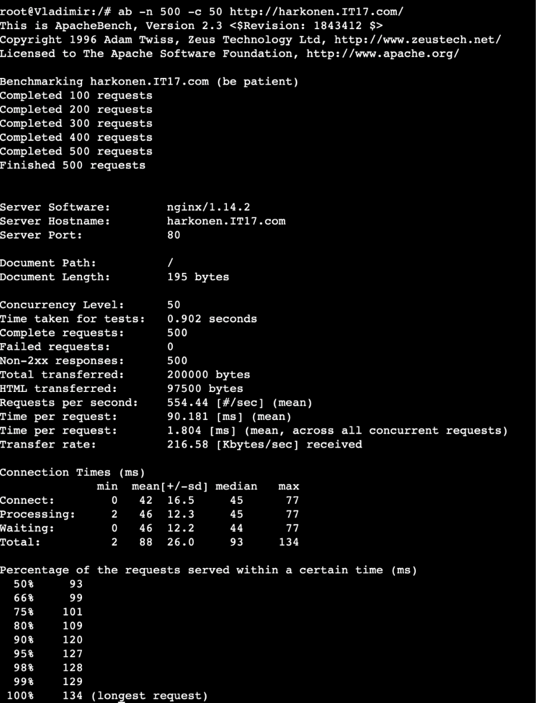

# Jarkom-Modul-3-IT17-2024

##### Praktikum Jaringan Komputer Modul 3 Tahun 2024

### Author
| Nama | NRP |
|---------|---------|
| Mutiara Nurhaliza | 5027221010   |
| Aqila Aqsa | 5027211032   |

# Laporan Resmi

### Topologi


### Config
#### Arakis (Router)
```
auto eth0
iface eth0 inet dhcp

auto eth1
iface eth1 inet static
	address 10.72.1.0
	netmask 255.255.255.0

auto eth2
iface eth2 inet static
	address 10.72.2.0
	netmask 255.255.255.0

auto eth3
iface eth3 inet static
	address 10.72.3.0
	netmask 255.255.255.0

auto eth4
iface eth4 inet static
	address 10.72.4.0
	netmask 255.255.255.0
```
#### Mohiam (DHCP Server) 
```
auto eth0
iface eth0 inet static
	address 10.72.3.2
	netmask 255.255.255.0
	gateway 10.72.3.0
```

#### Irulan (DNS Server) 
```
auto eth0
iface eth0 inet static
	address 10.72.4.1
	netmask 255.255.255.0
	gateway 10.72.4.0
```

#### Chani (Database Server) 
```
auto eth0
iface eth0 inet static
	address 10.72.4.1
	netmask 255.255.255.0
	gateway 10.72.4.0
```

#### Stilgar (Load Balancer) 
```
auto eth0
iface eth0 inet static
	address 10.72.4.2
	netmask 255.255.255.0
	gateway 10.72.4.0
```
#### Leto (Laravel Worker) 
```
auto eth0
iface eth0 inet static
	address 10.72.2.1
	netmask 255.255.255.0
	gateway 10.72.2.0
```

#### Duncan (Laravel Worker) 
```
auto eth0
iface eth0 inet static
	address 10.72.2.2
	netmask 255.255.255.0
	gateway 10.72.2.0
```

#### Jessica (Laravel Worker) 
```
auto eth0
iface eth0 inet static
	address 10.72.2.3
	netmask 255.255.255.0
	gateway 10.72.2.0
```

#### Vladimir (PHP Worker) 
```
auto eth0
iface eth0 inet static
	address 10.72.1.1
	netmask 255.255.255.0
	gateway 10.72.1.0
```
#### Rabban (PHP Worker)
```
auto eth0
iface eth0 inet static
	address 10.72.1.2
	netmask 255.255.255.0
	gateway 10.72.1.0
```
#### Vladimir (PHP Worker) 
```
auto eth0
iface eth0 inet static
	address 10.72.1.3
	netmask 255.255.255.0
	gateway 10.72.1.0
```


### Soal 0
Planet Caladan sedang mengalami krisis karena kehabisan spice, klan atreides berencana untuk melakukan eksplorasi ke planet arakis dipimpin oleh duke leto mereka meregister domain name atreides.yyy.com untuk worker Laravel mengarah pada Leto Atreides . Namun ternyata tidak hanya klan atreides yang berusaha melakukan eksplorasi, Klan harkonen sudah mendaftarkan domain name harkonen.yyy.com untuk worker PHP (0) mengarah pada Vladimir Harkonen

#### Script

```
echo 'nameserver 192.168.122.1' > /etc/resolv.conf
apt-get update
apt-get install bind9 -y  

echo "zone \"atreides.IT17.com\" {
	type master;
	file \"/etc/bind/jarkom/atreides.IT17.com\";
};

zone \"harkonen.IT17.com\" {
	type master;
	file \"/etc/bind/jarkom/harkonen.IT17.com\";
};
" > /etc/bind/named.conf.local

mkdir /etc/bind/jarkom

atreides="
;
;BIND data file for local loopback interface
;
\$TTL    604800
@    IN    SOA    atreides.IT17.com. root.atreides.IT17.com. (
        2        ; Serial
                604800        ; Refresh
                86400        ; Retry
                2419200        ; Expire
                604800 )    ; Negative Cache TTL
;                   
@    IN    NS    atreides.IT17.com.
@       IN    A    10.72.2.1
"
echo "$atreides" > /etc/bind/jarkom/atreides.IT17.com

harkonen="
;
;BIND data file for local loopback interface
;
\$TTL    604800
@    IN    SOA    harkonen.IT17.com. root.harkonen.IT17.com. (
        2        ; Serial
                604800        ; Refresh
                86400        ; Retry
                2419200        ; Expire
                604800 )    ; Negative Cache TTL
;                   
@    IN    NS    harkonen.IT17.com.
@       IN    A    10.72.1.1
"
echo "$harkonen" > /etc/bind/jarkom/harkonen.IT17.com

service bind9 restart

```
#### Output


### Soal 1

Lakukan konfigurasi sesuai dengan peta yang sudah diberikan. 

#### Output
Sesuai konfigurasi diatas

### Soal 2

Client yang melalui House Harkonen mendapatkan range IP dari [prefix IP].1.14 - [prefix IP].1.28 dan [prefix IP].1.49 - [prefix IP].1.70

Melakukan setup DHCP Relay terlebih dahulu pada Arakis.

` /etc/default/isc-dhcp-relay `
```
iptables -t nat -A POSTROUTING -o eth0 -j MASQUERADE -s 10.72.0.0/16
apt-get update
apt install isc-dhcp-relay -y

service isc-dhcp-relay start 

echo '# Defaults for isc-dhcp-relay initscript

# sourced by /etc/init.d/isc-dhcp-relay 
# installed at /etc/default/isc-dhcp-relay by the maintainer scripts

#
# This is a POSIX shell fragment
#

# What servers should the DHCP relay forward requests to?
SERVERS="10.72.3.2"

# On what interfaces should the DHCP relay (dhrelay) serve DHCP requests?
INTERFACES="eth1 eth2 eth3 eth4"

# Additional options that are passed to the DHCP relay daemon?
OPTIONS=""' > /etc/default/isc-dhcp-relay


echo net.ipv4.ip_forward=1 > /etc/sysctl.conf

service isc-dhcp-relay restart 
```
Konfigurasi DHCP Server pada Mohiam

```
echo 'nameserver 10.72.3.1' >> /etc/resolv.conf   # Pastikan DNS Server sudah berjalan 
apt-get update
apt-get install isc-dhcp-server -y

interfaces="INTERFACESv4=\"eth0\"
INTERFACESv6=\"\"
"
echo "$interfaces" > /etc/default/isc-dhcp-server

subnet="option domain-name \"example.org\";
option domain-name-servers ns1.example.org, ns2.example.org;

subnet 10.72.1.0 netmask 255.255.255.0 {
    range 10.72.1.14 10.72.1.28;
    range 10.72.1.49 10.72.1.70;
    option routers 10.72.1.0;
}

subnet 10.72.2.0 netmask 255.255.255.0 {
}

subnet 10.72.3.0 netmask 255.255.255.0 {
}

subnet 10.72.4.0 netmask 255.255.255.0 {
}
"
echo "$subnet" > /etc/dhcp/dhcpd.conf

service isc-dhcp-server restart
```

### Soal 3

Client yang melalui House Atreides mendapatkan range IP dari [prefix IP].2.15 - [prefix IP].2.25 dan [prefix IP].2 .200 - [prefix IP].2.210

Konfigurasi DHCP Server pada Mohiam

```
echo 'nameserver 10.72.3.1' >> /etc/resolv.conf   # Pastikan DNS Server sudah berjalan 
apt-get update
apt-get install isc-dhcp-server -y

interfaces="INTERFACESv4=\"eth0\"
INTERFACESv6=\"\"
"
echo "$interfaces" > /etc/default/isc-dhcp-server

subnet="option domain-name \"example.org\";
option domain-name-servers ns1.example.org, ns2.example.org;

subnet 10.72.1.0 netmask 255.255.255.0 {
    range 10.72.1.14 10.72.1.28;
    range 10.72.1.49 10.72.1.70;
    option routers 10.72.1.0;
}

subnet 10.72.2.0 netmask 255.255.255.0 {
    range 10.72.2.15 10.72.2.25;
    range 10.72.2.200 10.72.2.210;
    option routers 10.72.2.0;
}

subnet 10.72.3.0 netmask 255.255.255.0 {
}

subnet 10.72.4.0 netmask 255.255.255.0 {
}
"
echo "$subnet" > /etc/dhcp/dhcpd.conf

service isc-dhcp-server restart
```

### Soal 4

Client mendapatkan DNS dari Princess Irulan dan dapat terhubung dengan internet melalui DNS tersebut 

Ubah konfigurasi DHCP Server pada Mohiam agar mengarah ke IP DNS (10.72.3.1)
```
subnet 10.72.1.0 netmask 255.255.255.0 {
    range 10.72.1.14 10.72.1.28;
    range 10.72.1.49 10.72.1.70;
    option routers 10.72.1.0;
    option broadcast-address 10.72.1.255;
    option domain-name-servers 10.72.3.1;
}

subnet 10.72.2.0 netmask 255.255.255.0 {
    range 10.72.2.15 10.72.2.25;
    range 10.72.2.200 10.72.2.210;
    option routers 10.72.2.0;
    option broadcast-address 10.72.2.255;
    option domain-name-servers 10.72.3.1;
}

subnet 10.72.3.0 netmask 255.255.255.0 {
}

subnet 10.72.4.0 netmask 255.255.255.0 {
}
```
Lakukan konfigurasi DNS Server pada Irulan
```
nano /etc/bind/named.conf.options
forwarders {
  192.168.122.1;
}
allow-query{any;};
listen-on-v6 { any; };
```

#### Output
Uji coba ping google.com di client


### Soal 5

Durasi DHCP server meminjamkan alamat IP kepada Client yang melalui House Harkonen selama 5 menit sedangkan pada client yang melalui House Atreides selama 20 menit. Dengan waktu maksimal dialokasikan untuk peminjaman alamat IP selama 87 menit 

Tambahkan konfigurasi DHCP Server pada Mohiam

```
subnet 10.72.1.0 netmask 255.255.255.0 {
    range 10.72.1.14 10.72.1.28;
    range 10.72.1.49 10.72.1.70;
    option routers 10.72.1.0;
    option broadcast-address 10.72.1.255;
    option domain-name-servers 10.72.3.1;
    default-lease-time 300;
    max-lease-time 5220;
}

subnet 10.72.2.0 netmask 255.255.255.0 {
    range 10.72.2.15 10.72.2.25;
    range 10.72.2.200 10.72.2.210;
    option routers 10.72.2.0;
    option broadcast-address 10.72.2.255;
    option domain-name-servers 10.72.3.1;
    default-lease-time 1200;
    max-lease-time 5220;
}

subnet 10.72.3.0 netmask 255.255.255.0 {
}

subnet 10.72.4.0 netmask 255.255.255.0 {
}
```

#### Output


### Soal 6

Vladimir Harkonen memerintahkan setiap worker(harkonen) PHP, untuk melakukan konfigurasi virtual host untuk website berikut dengan menggunakan php 7.3.

Melakukan konfigurasi sebagai berikut pada php worker untuk melakukan download dan unzip menggunakan command wget

```
wget -O '/var/www/harkonen.IT17.com' 'https://drive.usercontent.google.com/download?id=1lmnXJUbyx1JDt2OA5z_1dEowxozfkn30&export=download&authuser=0'
unzip -o /var/www/harkonen.IT17.com -d /var/www/
rm /var/www/harkonen.IT17.com
mv /var/www/modul-3 /var/www/harkonen.IT17.com
```

melakukan konfigurasi pada nginx

```
cp /etc/nginx/sites-available/default /etc/nginx/sites-available/harkonen.IT17.com
ln -s /etc/nginx/sites-available/harkonen.IT17.com /etc/nginx/sites-enabled/
rm /etc/nginx/sites-enabled/default

echo 'server {
    listen 80;
    server_name _;

    root /var/www/harkonen.IT17.com;
    index index.php index.html index.html;

    location / {
        try_files $uri $uri/ /index.php?$query_string;
    }

    location ~ \.php$ {
        include snippets/fastcgi-php.conf;
        fastcgi_pass unix:/run/php/php7.3-fpm.sock; 
        fastcgi_param SCRIPT_FILENAME $document_root$fastcgi_script_name;
        include fastcgi_params;
    }
}' > /etc/nginx/sites-available/harkonen.IT17.com

service nginx restart
```
#### Output
Jalankan Perintah lynx localhost pada masing-masing worker


### Soal 7

Aturlah agar Stilgar dari fremen dapat dapat bekerja sama dengan maksimal, lalu lakukan testing dengan 5000 request dan 150 request/second.

Domain pada DNS Server diarahkan ke Load Balancer Stilgar

```
atreides="
;
;BIND data file for local loopback interface
;
\$TTL    604800
@    IN    SOA    atreides.IT17.com. root.atreides.IT17.com. (
        2        ; Serial
                604800        ; Refresh
                86400        ; Retry
                2419200        ; Expire
                604800 )    ; Negative Cache TTL
;                   
@    IN    NS    atreides.IT17.com.
@       IN    A    10.72.4.2
"
echo "$atreides" > /etc/bind/jarkom/atreides.IT17.com

harkonen="
;
;BIND data file for local loopback interface
;
\$TTL    604800
@    IN    SOA    harkonen.IT17.com.com. root.harkonen.IT17.com. (
        2        ; Serial
                604800        ; Refresh
                86400        ; Retry
                2419200        ; Expire
                604800 )    ; Negative Cache TTL
;                   
@    IN    NS    harkonen.IT17.com.
@       IN    A    10.72.4.2
"
echo "$harkonen" > /etc/bind/jarkom/harkonen.IT17.com
```
Konfigurasi untuk nginx pada node stilgar 
```

cp /etc/nginx/sites-available/default /etc/nginx/sites-available/lb_php


echo ' upstream worker {
    server 10.72.1.1;
    server 10.72.1.2;
    server 10.72.1.3;
}

server {
    listen 80;
    server_name harkonen.IT17.com www.harkonen.IT17.com;

    root /var/www/html;

    index index.html index.htm index.nginx-debian.html;

    server_name _;

    location / {
        proxy_pass http://worker;
        auth_basic "Restricted Content";
auth_basic_user_file /etc/nginx/supersecret/htpasswd;
    }
} ' > /etc/nginx/sites-available/lb_php

ln -s /etc/nginx/sites-available/lb_php /etc/nginx/sites-enabled/
rm /etc/nginx/sites-enabled/default

service nginx restart

```

#### Output
Pada node Paul (client) jalankan command " ab -n 1000 -c 100 http://granz.channel.it03.com/ "


### Soal 8

Karena diminta untuk menuliskan peta tercepat menuju spice, buatlah analisis hasil testing dengan 500 request dan 50 request/second masing-masing algoritma Load Balancer dengan ketentuan sebagai berikut:
```
1. Nama Algoritma Load Balancer.
2. Report hasil testing pada Apache Benchmark.
3. Grafik request per second untuk masing masing algoritma.
4. Analisis.
```
konfigurasinya sama dengan Soal 7, tinggal menambahkan beberapa konfigurasi untuk algoritma load balancer nya

#### Round-robin

```
echo ' upstream worker {
    server 10.72.1.1;
    server 10.72.1.2;
    server 10.72.1.3;
}
```
#### Generic Hash 

```
echo ' upstream worker {
    hash $request_uri consistent;
    server 10.72.1.1;
    server 10.72.1.2;
    server 10.72.1.3;
}

```
#### Least Connetion 

```
echo ' upstream worker {
    least_conn;
    server 10.72.1.1;
    server 10.72.1.2;
    server 10.72.1.3;
}

```
#### IP hash  

```
echo ' upstream worker {
    ip_hash;
    server 10.72.1.1;
    server 10.72.1.2;
    server 10.72.1.3;
}

```
#### Stilgar.sh
```

echo ' upstream worker {
    #    hash $request_uri consistent;
    #    least_conn;
    #    ip_hash;
    server 10.72.1.1;
    server 10.72.1.2;
    server 10.72.1.3;
}

server {
    listen 80;
    server_name harkonen.IT17.com www.harkonen.IT17.com;

    root /var/www/html;

    index index.html index.htm index.nginx-debian.html;

    server_name _;

    location / {
        proxy_pass http://worker;

} ' > /etc/nginx/sites-available/lb_php

ln -s /etc/nginx/sites-available/lb_php /etc/nginx/sites-enabled/
rm /etc/nginx/sites-enabled/default

service nginx restart
```


#### Output

#### Round Robin


#### Generic Hash


#### Least Connection


#### IP Hash


#### Grafik


### Soal 9

Dengan menggunakan algoritma Least-Connection, lakukan testing dengan menggunakan 3 worker, 2 worker, dan 1 worker sebanyak 1000 request dengan 10 request/second, kemudian tambahkan grafiknya pada peta.

Masukan script yang sama seperti no.7 hanya saja jumlah worker disesuaikan

##### 3 Worker
```
echo ' upstream worker {
    #    hash $request_uri consistent;
    #    least_conn;
    #    ip_hash;
    server 10.72.1.1;
    server 10.72.1.2;
    server 10.72.1.3;
}
```

##### 2 Worker
```
echo ' upstream worker {
    #    hash $request_uri consistent;
    #    least_conn;
    #    ip_hash;
    #    server 10.72.1.1;
    server 10.72.1.2;
    server 10.72.1.3;
}
```

##### 1 Worker
```
echo ' upstream worker {
    #    hash $request_uri consistent;
    #    least_conn;
    #    ip_hash;
    #    server 10.72.1.1;
    #  	 server 10.72.1.2;
    server 10.72.1.3;
}
```


#### Output
#### 3 Worker

#### 2 Worker

#### 1 Worker

#### Grafik


### Soal 10

Selanjutnya coba tambahkan keamanan dengan konfigurasi autentikasi di LB dengan dengan kombinasi username: “secmart” dan password: “kcksyyy”, dengan yyy merupakan kode kelompok. Terakhir simpan file “htpasswd” nya di /etc/nginx/supersecret/

Membuat folder rahasisakita dengan " mkdir /etc/nginx/supersecret " lalu " htpasswd -c /etc/nginx/supersecret/htpasswd secmart " untuk membuat kredensial.

```
Username: secmart
Password: kcksIT17

```
Menambahkan script didalam Stilgar
```

cp /etc/nginx/sites-available/default /etc/nginx/sites-available/lb_php
mkdir /etc/nginx/supersecret
htpasswd -c /etc/nginx/supersecret/htpasswd secmart


echo ' upstream worker {
    #    hash $request_uri consistent;
    #    least_conn;
    #    ip_hash;
    server 10.72.1.1;
    server 10.72.1.2;
    server 10.72.1.3;
}

server {
    listen 80;
    server_name harkonen.IT17.com www.harkonen.IT17.com;

    root /var/www/html;

    index index.html index.htm index.nginx-debian.html;

    server_name _;

    location / {
        proxy_pass http://worker;
        auth_basic "Restricted Content";
	auth_basic_user_file /etc/nginx/supersecret/htpasswd;
    }

} ' > /etc/nginx/sites-available/lb_php

ln -s /etc/nginx/sites-available/lb_php /etc/nginx/sites-enabled/
rm /etc/nginx/sites-enabled/default

service nginx restart

```
#### Output
Jalankan " lynx http://harkonen.IT17.com/ " pada Paul (Client) untuk melihat apakah autentikasi bisa berfungsi.


### Soal 11
